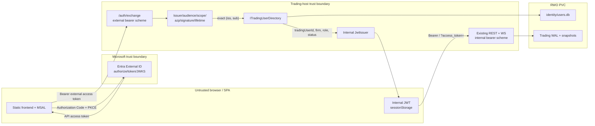
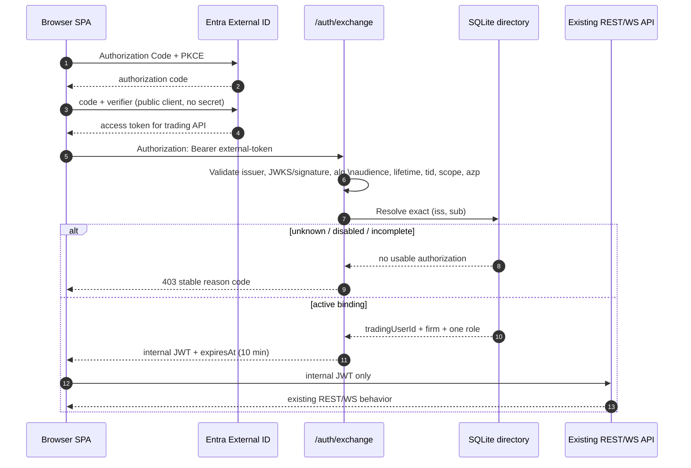

# RFC: external-identity-v0 — Entra token exchange + SQLite authorization directory

> Status: **Proposed** · Tracking:
> [#605](https://github.com/pedrosakuma/B3TradingPlatform/issues/605) ·
> Parent: [#604](https://github.com/pedrosakuma/B3TradingPlatform/issues/604)
>
> Implementation: [#606](https://github.com/pedrosakuma/B3TradingPlatform/issues/606)
> → [#607](https://github.com/pedrosakuma/B3TradingPlatform/issues/607)
> → [#608](https://github.com/pedrosakuma/B3TradingPlatform/issues/608) /
> [#609](https://github.com/pedrosakuma/B3TradingPlatform/issues/609)

## 1. Decision

Human/browser authentication moves to **Microsoft Entra External ID**.
Trading-specific authorization remains owned by this platform in a
**SQLite directory on the existing trading-host RWO PVC**.

The browser authenticates with Authorization Code + PKCE, obtains an Entra
**access token for the trading API**, and sends it to `POST /auth/exchange`.
The trading-host validates that external token under a dedicated bearer
scheme, resolves its exact `(issuer, subject)` binding in SQLite, and issues
the existing internal JWT contract:

- `sub` = immutable internal `tradingUserId`;
- `firm` = platform-authoritative firm;
- `role` = platform-authoritative role;
- `jti`, `iat`/`nbf` and `exp` = internal session metadata.

Entra proves who authenticated. It does **not** choose a trading owner, firm,
role, account status, cash balance or position.

The internal JWT lifetime becomes **10 minutes** in Hybrid/Entra modes. There
is no internal refresh token. Renewal means obtaining/reusing a valid Entra
access token through the OIDC library and exchanging again. Therefore a firm,
role or status change may remain effective in an already-issued session for
at most 10 minutes plus the existing 30-second validation clock skew.

SQLite is accepted only while the trading-host remains one active writer on
one `ReadWriteOnce` PVC. It is not a replacement for the trading WAL and must
live behind a separate `ITradingUserDirectory` abstraction.

## 2. Why direct Entra bearer authentication is rejected

The current platform treats internal claims as business authority:

```text
sub  -> trading owner / EndClientId
firm -> position, P&L, statement and drop-copy partition
role -> admin/compliance authorization
```

An Entra token cannot safely replace that token:

- Entra `sub` identifies an external principal for an issuer/client context,
  not a trading owner.
- `oid`, `email`, `preferred_username`, `name` and tenant/app roles do not
  constitute a platform provisioning decision.
- Entra claims must not create FIRM01 accounts, positions or cash.
- Existing orders, history, bot credentials and audit records are keyed by
  the platform's current owner IDs.

Passing the Entra principal directly to existing endpoints would silently
change ownership and authorization semantics. The exchange is the explicit
trust boundary that prevents that.

## 3. Current state and affected contracts

### 3.1 Authentication and token issuance

| Concern | Current contract |
| --- | --- |
| Local credentials | `AuthOptions.UserConfig` owns username, PBKDF2 password material, one role, one firm and TOTP state (`backend/src/B3.Trading.Api/Auth/AuthOptions.cs`). |
| Directory | `IUserStore` combines credential lookup, signup and TOTP mutations. `InMemoryUserStore` and `FileBackedUserStore` use case-insensitive usernames. |
| Persistence | Runtime users are stored in `{Persistence:DataDirectory}/users.json`; env-seeded users remain configuration-authoritative (`TradingAuthServiceCollectionExtensions.cs:46-71`). |
| Corruption policy | The JSON store currently warns and starts with an empty runtime set (`FileBackedUserStore.cs:30-34`, `FileBackedUserStoreTests.cs:98-121`). The SQLite authorization directory will deliberately fail closed instead. |
| Login/signup | `/auth/login` validates password/TOTP and `/auth/signup` creates a FIRM01 user, seeds positions/cash and immediately mints a JWT (`AuthEndpoints.cs`). |
| TOTP | `/auth/2fa/enroll`, `/verify` and `/disable` use `IUserStore`; successful verification mints the same JWT (`TotpEndpoints.cs:206-224`). |
| JWT mint | `JwtIssuer` emits HS256 `sub`, `jti`, `role`, `firm`; default lifetime is currently 60 minutes. |
| JWT validation | One default bearer scheme validates internal issuer, audience, lifetime and symmetric key; `NameClaimType=sub`, `RoleClaimType=role` (`TradingAuthServiceCollectionExtensions.cs:75-116`). |
| WebSocket token | Only `/ws` paths may read the internal JWT from `?access_token=` because browsers cannot set the upgrade `Authorization` header. |

The new external bearer scheme is additional and route-scoped. It must never
replace the default internal bearer scheme.

### 3.2 `sub` call sites

The following current surfaces consume `sub` as owner or actor:

| Surface | Files / behavior |
| --- | --- |
| Order ownership | `OrdersEndpoints.cs`, `AlgoEndpoints.cs` resolve `sub` through `EndClientRegistry.Register`. |
| Read ownership | `HistoryEndpoints.cs`, `StatementEndpoints.cs`, `BalanceEndpoints.cs`, `PositionsEndpoints.cs`, `PnlEndpoints.cs` derive the owner from `sub`. |
| WebSocket ownership | `WebSockets/WebSocketHub.cs` registers `sub` as the subscribed owner; `DropCopyWebSocketHub.cs` records the connecting principal. |
| Bot credentials | `UserBotCredentialsEndpoints.cs` keys create/list/bind/revoke operations by `sub`. |
| Audit actors | `AdminEndpoints.cs`, `SubAccountsEndpoints.cs`, `CvmReportEndpoints.cs`, `SimulatorEndpoint.cs` and `AdminFixpEndpoints.cs` copy `sub` into actor fields. |
| Auth/TOTP | `AuthEndpoints.cs` and `TotpEndpoints.cs` register/mint using the username; authenticated TOTP operations look users up by `sub`. |
| Rate limiting | `TokenBucketRateLimitMiddleware` uses `User.Identity.Name`, which is mapped from `sub`, as the authenticated bucket key. |

`EndClientRegistry.Register` currently lowercases the login when creating an
`EndClientId` (`EndClientRegistry.cs:13-22`), while JWTs, audit actors and bot
credentials preserve the raw username string. Import therefore preserves the
exact current JWT `sub` as `tradingUserId` and leaves the existing
`EndClientRegistry` lowercase mapping unchanged. It rejects ambiguous
case-insensitive legacy username collisions before writing any rows.

### 3.3 `firm` call sites

`firm` partitions or constrains:

- orders, fills, positions, P&L, statements and sub-accounts;
- compliance audit reads and CVM report downloads;
- trader and drop-copy WebSocket subscriptions;
- admin/audit actor metadata.

The direct consumers are in `OrdersEndpoints.cs`, `FillsEndpoints.cs`,
`PositionsEndpoints.cs`, `PnlEndpoints.cs`, `StatementEndpoints.cs`,
`SubAccountsEndpoints.cs`, `AlgoEndpoints.cs`, `AdminAuditEndpoints.cs`,
`CvmReportEndpoints.cs`, `WebSocketHub.cs`, `DropCopyWebSocketHub.cs`,
`AdminEndpoints.cs`, `SimulatorEndpoint.cs` and `AdminFixpEndpoints.cs`.

Several paths currently fall back to `"default"` when the claim is missing.
The exchange must not rely on that fallback: a directory user without a
non-empty firm is `account_incomplete` and receives no token.

### 3.4 `role` call sites

Authorization policies use `role` as `RoleClaimType`:

- `admin`;
- `admin-or-compliance`;
- `ComplianceOrAdmin`.

Direct role reads also occur in `AdminAuditEndpoints.cs`,
`CvmReportEndpoints.cs`, `DropCopyWebSocketHub.cs`, `AdminEndpoints.cs`,
`SubAccountsEndpoints.cs`, `SimulatorEndpoint.cs` and
`AdminFixpEndpoints.cs`. `FillsEndpoints.cs` and the rate limiter use
`IsInRole`.

Although the SQLite schema is normalized as `user_roles`, **v0 permits exactly
one active role per user** (`user`, `compliance` or `admin`). This preserves
the current single-string frontend and `FindFirstValue("role")` behavior.
Multiple simultaneous roles require a later RFC that removes those
single-value assumptions.

### 3.5 Frontend and deployment

- `frontend/js/app.js` performs local password/TOTP login, decodes the
  internal JWT for cosmetic role/firm UI, and currently renews by asking for
  the password again.
- Internal sessions are stored in `sessionStorage` by default, but "Remember
  me" mirrors them to `localStorage`.
- REST uses `Authorization: Bearer <internal JWT>`; trader and drop-copy
  WebSockets use the internal JWT in `?access_token=`.
- The host is a singleton StatefulSet with a 4 GiB `ReadWriteOnce` PVC mounted
  at `/var/lib/b3trading`; its baseline request is 150m CPU / 768 MiB memory.
- Data Protection keys already live under
  `{Persistence:DataDirectory}/dp-keys`.
- CI publishes both `linux/amd64` and `linux/arm64` images.
- No SQLite package is currently present.

## 4. Goals, non-goals and invariants

### 4.1 Goals

1. Delegate human authentication and MFA to Entra External ID.
2. Preserve every existing trading owner ID and internal claim meaning.
3. Keep firm, role, status and external linking platform-authoritative.
4. Add transactional, migratable authorization persistence without another
   always-on service.
5. Migrate through a reversible Hybrid mode without public JIT provisioning.
6. Fail closed on unknown identity, invalid token or unusable directory.

### 4.2 Non-goals

- PostgreSQL, active-active or multi-writer trading-host.
- Direct Entra bearer access to REST or WebSockets.
- Email/display-name matching or automatic account creation.
- Automatic cash/position provisioning after external signup.
- Bot PAT/FIXP/mTLS identity changes.
- A new WebAuthn implementation for public human login. Entra-managed factors
  supersede #319 for that surface.
- Regulated-broker IAM, entitlement workflows or cross-firm mandates.

### 4.3 Invariants

1. `sub` in the internal token remains the stable trading owner ID.
2. `(issuer, subject)` only authenticates an existing internal user.
3. Firm, role and status are read only from `ITradingUserDirectory`.
4. Unknown or disabled principals have no provisioning side effects.
5. External tokens never authenticate the default REST/WS bearer scheme.
6. Internal tokens never authenticate `POST /auth/exchange`.
7. Existing valid internal sessions require no SQLite read on an order path.
8. SQLite is valid only with one active process writer and an RWO volume.
9. Local password/TOTP is transitional and cannot remain a public Entra-mode
   backdoor.

## 5. Trust boundaries and sequence



The browser is not trusted to identify its firm, role or internal owner. JWT
decoding in the frontend remains cosmetic. The host validates both token
classes; SQLite and the internal signing key are server-side authorities.



## 6. External token validation contract

`POST /auth/exchange` uses a named external scheme, for example
`EntraExternal`. The default scheme remains the internal JWT scheme.

The endpoint accepts only a signed **delegated access token** that satisfies
all of the following:

| Check | Required behavior |
| --- | --- |
| Metadata | Load OIDC/OAuth metadata from the configured External ID authority. Never follow a key URL supplied by the token. |
| Issuer | Exact ordinal match to the configured issuer returned by trusted metadata. The issuer path is significant; do not trim slashes or accept aliases at runtime. |
| Tenant | `tid` equals the configured external tenant ID when the claim is present/required by the selected authority profile. No `common`, `organizations` or arbitrary tenant issuer is accepted. |
| Signature/key | Validate with the trusted issuer's JWKS and key ID. Unknown keys trigger one throttled metadata refresh, then rejection if still unknown. |
| Algorithm | Explicit allow-list; `RS256` for the initial Entra profile. Reject `none`, symmetric algorithms and algorithm/key-type confusion. |
| Audience | Exact configured trading API audience. Tokens whose `aud` is the SPA client ID or another API are rejected. |
| Lifetime | Validate `exp` and `nbf` with at most the platform's existing 30-second skew. |
| Delegation | Require the exact configured delegated scope in `scp`. App-only `roles` tokens are not accepted by this browser exchange endpoint. |
| Client actor | Require `azp` (v2) or `appid` (v1, if ever enabled) in an allow-list of SPA client IDs. |
| Token version/client type | Require `ver = 2.0`. When `azpacr` is present, require public-client value `0`; reject confidential-client values. The SPA registration must have no client credential. |
| Subject | Require non-empty `sub`; treat it as opaque and case-sensitive. |

The initial implementation supports **v2 access tokens only**. Supporting v1
tokens would multiply audience and actor-claim rules and has no sandbox
benefit.

### 6.1 ID tokens are always rejected

An ID token authenticates the user to the SPA and has the SPA client ID as its
intended audience. It is not authorization to call the trading API. The
exchange endpoint rejects it through audience and scope validation even if
its signature and issuer are otherwise valid.

The frontend may use ID-token display claims for the Entra library's login UX,
but must never send them as firm, role or account-linking authority.

### 6.2 External ID authority

The configured authority is tenant-specific, normally:

```text
https://{tenant-subdomain}.ciamlogin.com/{tenant-id}/v2.0
```

If a custom External ID domain is used, authority, metadata and
`knownAuthorities` must all name that domain. Changing from the CIAM domain to
a custom domain changes the canonical issuer and therefore requires an
explicit binding migration; it is not a transparent string normalization.

Tenant, API application/audience or SPA app-registration changes also require
a controlled identity preflight. Before rollout, acquire a token through the
new registration, compare its validated `(iss, sub)` and `azp` with the
existing binding/allow-list, and pre-bind the new `(iss, sub)` while the old
path still works if either value changes. Never assume a replacement client or
resource registration preserves pairwise subject values.

### 6.3 Metadata and key rollover failure

The standard Microsoft identity middleware owns metadata/JWKS caching and key
rollover:

- retain the last known good configuration;
- refresh periodically and on an unknown `kid`, with throttling;
- continue validating tokens against cached known-good keys during a metadata
  outage;
- reject a token whose key cannot be validated after refresh.

Already-issued internal JWTs do not depend on Entra metadata and continue to
work until their 10-minute expiry. New exchanges fail closed with
`503 identity_provider_unavailable` when validation cannot establish trust.

## 7. Identity and claims model

### 7.1 Canonical external key

The only lookup key is:

```text
(issuer, subject) = (validated iss, validated sub)
```

- Both values are opaque, case-sensitive strings stored with binary
  comparison.
- "Normalized issuer" means the one configured canonical issuer that passed
  exact validation. It does not mean generic URI rewriting.
- `oid` and `tid` may be retained as nullable diagnostic attributes to help
  operators investigate tenant/object changes.
- `oid`, `tid`, email, username and display name are never alternate lookup,
  uniqueness or account-linking keys.
- One internal user may have more than one explicit external binding (for
  controlled issuer/domain migration). One `(issuer, subject)` may bind to
  exactly one internal user.

### 7.2 Internal `tradingUserId`

`tradingUserId` is:

- an immutable, non-empty string of at most 64 characters;
- the value emitted as internal JWT `sub`;
- the value that preserves the current owner namespace;
- never derived from Entra email/name at login;
- not editable by an admin mutation.

Legacy import uses the existing configured/runtime username and verifies the
existing `EndClientRegistry` mapping without replacing it. The exact current
JWT `sub` becomes `tradingUserId`, preserving raw-`sub` stores such as bot
credentials and audit; order/position ownership continues to map that value
through the existing lowercase `EndClientRegistry` behavior. Import aborts on
case-insensitive duplicate usernames, owner collisions or any mapping that
would rename either namespace. New post-migration IDs should use lowercase
ASCII for operational simplicity, but no existing ID is rewritten merely to
meet that recommendation.

`display_name` is mutable presentation metadata and has no authorization
meaning.

### 7.3 Internal JWT

The exchange emits:

| Claim | Source | Contract |
| --- | --- | --- |
| `iss` | `AuthOptions.Issuer` | Existing internal issuer. |
| `aud` | `AuthOptions.Audience` | Existing REST/WS clients. |
| `sub` | `users.trading_user_id` | Stable owner/actor ID. |
| `role` | sole `user_roles.role` row | One of `user`, `compliance`, `admin`. |
| `firm` | `users.firm_id` | Non-empty platform firm. |
| `jti` | New random ID | Session/audit correlation; not a directory key. |
| `iat`, `nbf`, `exp` | Internal clock | 10-minute lifetime, 30-second skew. |
| `amr` | Constant `entra_exchange` | Additive diagnostic claim; no authorization policy depends on it. |

The external `iss`, `sub`, `oid`, `tid`, `scp`, `azp`, email and Entra roles
are not copied into the internal JWT.

## 8. Exchange API

### 8.1 Request and success response

```http
POST /auth/exchange
Authorization: Bearer <Entra access token for trading API>
```

No request body is required. The success response intentionally reuses the
local login session shape:

```json
{
  "token": "<internal JWT>",
  "expiresAt": "2026-07-15T22:30:00Z"
}
```

The endpoint:

1. validates the token under the external scheme;
2. extracts exact `(iss, sub)`;
3. resolves a unique binding;
4. requires `users.status = active`, one non-empty firm and exactly one role;
5. pre-registers the stable internal owner as local login does today;
6. issues the internal JWT;
7. emits a bounded audit event/metric without storing the token or raw
   external subject.

### 8.2 Failure contract

| HTTP | Code | Meaning |
| --- | --- | --- |
| 401 | `invalid_external_token` | Signature, issuer, tenant, audience, lifetime, algorithm, scope or SPA actor validation failed. |
| 403 | `account_not_provisioned` | Valid external principal has no explicit binding. |
| 403 | `account_disabled` | Binding exists but the internal user is disabled. |
| 403 | `account_incomplete` | User has no firm or does not have exactly one valid role. |
| 409 | `identity_binding_conflict` | Directory constraints detect a conflicting binding during an admin operation, never during a read-only exchange. |
| 429 | `rate_limited` | Existing auth limiter policy. |
| 503 | `identity_provider_unavailable` | Trusted Entra metadata/key validation is unavailable. |
| 503 | `identity_directory_unavailable` | SQLite cannot provide a trustworthy result. |

The endpoint never calls signup and never seeds positions or cash.

### 8.3 Audit and metrics

Add open-set events:

```text
auth.exchange.success
auth.exchange.failure
identity.binding.create
identity.binding.delete
identity.user.status_change
identity.user.authorization_change
```

Audit records include internal actor/target IDs, binding row ID, configured
issuer alias, outcome and bounded reason code. They do not include bearer
tokens, raw `sub`, `oid`, email or arbitrary claim values.

Metrics use only bounded labels such as `result`, `reason` and configured
issuer alias. Raw external subjects are not emitted to logs, audit or metrics;
diagnostics use the binding row ID or a bounded keyed hash. Trading user IDs
may remain in access-controlled logs/audit, but never metric labels.

## 9. SQLite authorization directory

### 9.1 Abstraction

`ITradingUserDirectory` is independent from `IUserStore`:

```text
ResolveExternalIdentity(issuer, subject)
GetUser(tradingUserId)
ImportLegacyUser(...)
BindExternalIdentity(...)
UnbindExternalIdentity(...)
SetStatus(...)
SetFirmAndRole(...)
ListUsersAndBindings(...)
CreateBackup(...)
```

Exchange and admin provisioning depend on this abstraction. Password/TOTP
credential verification does not enter it.

All paths that mint an internal token use one shared directory-backed session
issuer. In Local mode it preserves the current `IUserStore` role/firm
behavior. In Hybrid/Entra it accepts only a successfully authenticated
identity, resolves `tradingUserId` in `ITradingUserDirectory`, requires active
status/non-empty firm/exactly one role, and only then delegates to
`JwtIssuer`. `/auth/login`, `/auth/2fa/verify` and `/auth/exchange` therefore
cannot drift into separate authorization rules.

### 9.2 Minimum schema

```sql
CREATE TABLE schema_migrations (
    version       INTEGER PRIMARY KEY,
    applied_at    TEXT NOT NULL
);

CREATE TABLE users (
    trading_user_id TEXT NOT NULL PRIMARY KEY COLLATE BINARY
        CHECK (length(trading_user_id) BETWEEN 1 AND 64),
    display_name    TEXT NOT NULL CHECK (length(display_name) > 0),
    firm_id         TEXT NOT NULL CHECK (length(firm_id) > 0),
    status          TEXT NOT NULL CHECK (status IN ('active', 'disabled')),
    created_at      TEXT NOT NULL,
    updated_at      TEXT NOT NULL,
    row_version     INTEGER NOT NULL DEFAULT 1
);

CREATE TABLE external_identities (
    id              INTEGER PRIMARY KEY,
    issuer          TEXT NOT NULL COLLATE BINARY CHECK (length(issuer) > 0),
    subject         TEXT NOT NULL COLLATE BINARY CHECK (length(subject) > 0),
    trading_user_id TEXT NOT NULL CHECK (length(trading_user_id) BETWEEN 1 AND 64),
    tenant_id       TEXT NULL,
    object_id       TEXT NULL,
    created_at      TEXT NOT NULL,
    UNIQUE (issuer, subject),
    FOREIGN KEY (trading_user_id)
        REFERENCES users(trading_user_id) ON DELETE RESTRICT
);

CREATE TABLE user_roles (
    trading_user_id TEXT NOT NULL PRIMARY KEY
        CHECK (length(trading_user_id) BETWEEN 1 AND 64),
    role            TEXT NOT NULL
        CHECK (role IN ('user', 'compliance', 'admin')),
    FOREIGN KEY (trading_user_id)
        REFERENCES users(trading_user_id) ON DELETE CASCADE
);
```

The primary key makes one role per user a database invariant in v0. Startup
integrity checks reject any migrated/hand-edited state where an active user
does not have exactly one valid role. A later multi-role RFC may migrate this
table to a composite key after every single-value claim consumer is removed.

Timestamps are UTC RFC 3339 text. `row_version` increments on every user,
status, firm, role, bind or unbind mutation and is required as the expected
version for admin writes. Binding-set changes lock/update the owning user row
in the same transaction, so two concurrent link operations cannot both pass
the same expected version.

### 9.3 Location and connection policy

Default path:

```text
{Trading:Persistence:DataDirectory}/identity/users.db
```

On AKS this resolves under `/var/lib/b3trading/identity/users.db`.

Every connection sets:

```sql
PRAGMA foreign_keys = ON;
PRAGMA busy_timeout = 5000;
PRAGMA journal_mode = WAL;
PRAGMA synchronous = FULL;
```

Identity writes are rare, so `FULL` durability is preferred over the small
latency gain from `NORMAL`. Migrations and mutations use explicit
transactions; migrations acquire the write lock before inspecting/updating
`schema_migrations`.

### 9.4 Boot and readiness

When the configured provider is SQLite:

- create the parent directory with the existing non-root/fsGroup posture;
- open the database and apply every known migration transactionally;
- reject an unsupported future schema version;
- run integrity/foreign-key checks and verify every active user has exactly
  one role and a non-empty firm;
- fail startup on an unreadable database, failed migration or corruption;
- never rename/delete the file and start empty;
- make readiness fail if the directory later becomes unusable.

Liveness remains process health, not database health, so Kubernetes does not
loop-restart a process that needs operator restore. A runtime directory
failure removes the singleton from ready traffic and exchanges fail with 503;
existing sessions are not guaranteed service through ingress until directory
health is restored. This is deliberately stricter than an Entra metadata
outage, which leaves readiness up and existing internal sessions usable.

#606 must also correct the current chart probe wiring: readiness targets
`/ready`, which includes directory health, while liveness targets `/live`,
which remains process-only. `/health` remains rich diagnostic JSON and is not
used as either Kubernetes probe.

### 9.5 Concurrency and hot-path boundary

- The StatefulSet remains hardcoded to one replica.
- Migrations and writes are serialized in-process, but database constraints
  and transactions are the correctness boundary.
- Exchange performs one directory lookup; ordinary authenticated REST/WS
  requests do not query SQLite.
- v0 starts without a cross-exchange authorization cache. SQLite lookup volume
  is negligible at a 10-minute session cadence and avoiding a cache removes
  another revocation delay.
- Admin writes invalidate any implementation-local prepared/read state before
  returning success.

### 9.6 Backup and restore

Use SQLite's online backup API to produce a consistent database copy while the
host remains live. Do not copy `users.db`, `-wal` and `-shm` independently.

The deployment backup unit contains:

- the online SQLite backup;
- the existing trading WAL/snapshots according to their own procedure;
- `users.json` and `dp-keys` while Hybrid/local TOTP remains enabled;
- a manifest with schema version, timestamp, image digest and checksums.

Restore is offline for the identity directory:

1. stop the trading-host writer;
2. move/remove the old `users.db`, `users.db-wal` and `users.db-shm` as one
   recovery set so no stale WAL frames survive;
3. restore the online-backup output to a temporary path on the PVC;
4. run integrity, foreign-key and supported-schema checks;
5. atomically place the restored DB and reapply the configured WAL pragmas on
   first open;
6. start in Hybrid or Entra mode;
7. verify one provisioned admin exchange before reopening public ingress.

Deployment scheduling/upload belongs to `pedrosakuma/b3deploy`.

### 9.7 PostgreSQL migration triggers

SQLite v0 must be replaced before any of these become requirements:

- more than one active trading-host process writes authorization state;
- the data volume is no longer exclusively RWO-attached to one writer;
- provisioning is split into another service/process;
- measured busy/lock errors exceed 1% of directory writes over 15 minutes;
- identity recovery objectives require independent database failover rather
  than PVC reattach/restore.

Provider-specific SQL stays behind `ITradingUserDirectory`; IDs, status
values, timestamps and optimistic concurrency remain portable.

## 10. Auth modes and endpoint exposure

`Trading:Auth:Mode` is explicit:

| Capability | Local | Hybrid | Entra |
| --- | ---: | ---: | ---: |
| `/auth/login` | enabled | enabled only when `LocalLoginEnabled=true` | not mapped |
| `/auth/signup` | existing config | disabled by default; explicit dev-only opt-in | not mapped |
| `/auth/2fa/*` | existing config | enabled only with local login | not mapped |
| `/auth/exchange` | not mapped | enabled | enabled |
| SQLite directory | optional until #606 is enabled | required and authorization-authoritative | required and authorization-authoritative |
| Linked external admin boot guard | no | warning until migration completes | required |

Compatibility default when the code first lands is `Local`; no deployment
silently changes behavior. The production rollout explicitly sets `Hybrid`,
completes binding, and finally sets `Entra`.

In Hybrid, local password/TOTP proves identity but **firm, role and status come
from SQLite**, not `UserConfig`. This prevents two authorization authorities.
An imported local user missing from SQLite fails with
`account_not_provisioned`. Specifically, successful password or TOTP
verification calls the same directory-backed internal session issuer as
`/auth/exchange`; `UserConfig.Role` and `UserConfig.Firm` are ignored when
minting in Hybrid.

Production Hybrid defaults:

```text
LocalLoginEnabled = true only for the migration window
SignupEnabled     = false
TotpEnabled       = true only for local accounts still in use
ExchangeEnabled   = true
```

Entra-mode boot fails unless at least one active externally linked admin
exists. Entra mode also refuses any local endpoint-enabling flag.

## 11. Legacy import and migration

### 11.1 Import

The #606 importer reads env-seeded and runtime users through an explicit
legacy snapshot/export seam; it must not scrape `IUserStore` internals.

For each user it transactionally creates, if absent:

```text
users.trading_user_id = existing stable username/owner ID
users.display_name    = current username
users.firm_id         = current UserConfig.Firm
users.status          = active
user_roles.role       = current UserConfig.Role
```

The import:

- is idempotent;
- never creates `external_identities`;
- never infers links from email/name;
- preserves password/TOTP only in the legacy store;
- reports and aborts on duplicate/colliding IDs, invalid firm/role or an
  existing row whose immutable identity conflicts;
- creates no position, cash or bot credential.

### 11.2 Staged migration

1. Deploy #606 in `Local`; migrate/create SQLite and import owners. Local
   behavior remains unchanged.
2. Verify imported IDs/firm/role against current JWTs and ownership history.
3. Deploy #607 and enter `Hybrid` with signup disabled.
4. Using the current local admin session, complete an explicit self-link
   ceremony to a validated Entra `(iss, sub)`.
5. Exchange as that admin and verify admin, firm, audit and WS behavior.
6. Bind existing `alice`/`bob` users explicitly; verify old orders, positions,
   statements and bot credentials remain under the same `sub`.
7. Deploy #608 and switch the frontend to Entra login while retaining a
   private local login path for the short migration window.
8. Disable public local login/TOTP, verify the Entra-mode admin guard, then
   set `Mode=Entra`.
9. Remove local password material from active deployment configuration after
   the rollback window.

No stage automatically creates a user from an Entra signup.

### 11.3 Explicit linking ceremony

Bootstrap/linking requires two authenticated facts in one short-lived,
single-use operation:

1. an existing internal admin JWT;
2. a separately validated Entra access token for the configured SPA/API.

The server binds the external `(iss, sub)` to a named existing
`tradingUserId` under optimistic concurrency. The UI never asks an operator to
copy/paste email, `oid` or raw subject strings. Bind/unbind and before/after
authorization state are audited.

The concrete bootstrap/admin route is:

```http
POST /admin/identity/users/{tradingUserId}/external-bindings
Authorization: Bearer <internal admin JWT>
Content-Type: application/json

{
  "externalAccessToken": "<Entra access token>",
  "expectedRowVersion": 7
}
```

The route itself authenticates only under the internal admin scheme. It passes
the bounded body token directly to the external token validator without
placing it in logs, model stringification, URLs or audit. The external token
cannot authenticate the admin route, and the internal token cannot satisfy
the external validation step. The request body has a conservative maximum
size and is never retained after validation.

The transaction rejects:

- a binding already owned by another user;
- an unknown target user;
- stale `row_version`;
- disabling/unlinking the last usable admin;
- any request that attempts to create cash/positions.

## 12. Bootstrap, break-glass and rollback

### 12.1 Initial bootstrap

The current live-shaped Helm values seed `alice`/`bob` only as `user`; public
signup also creates only `user`. Bootstrap therefore has a mandatory Local
preflight:

1. inject a temporary local admin username/password hash/salt through Key
   Vault and `Trading:Auth:Users`, never through signup or committed values;
2. start in Local, import that exact admin as an active SQLite admin and verify
   local admin authorization;
3. enter Hybrid and local-login as that admin;
4. authenticate the intended Entra admin;
5. complete explicit self-link;
6. exchange and verify the new internal admin JWT;
7. only then allow an Entra-mode transition;
8. remove the temporary local credential after the rollback window.

Public signup is never needed.

### 12.2 Break-glass

There is no permanently mapped break-glass HTTP endpoint.

Lost-admin recovery is an operational procedure requiring deployment and Key
Vault/PVC access:

1. restrict public ingress and record an incident/change ticket;
2. switch the deployment from `Entra` to `Hybrid`;
3. inspect/restore directory health before attempting credential recovery;
4. if an active admin row still exists, inject a freshly generated,
   short-lived local credential for that same `tradingUserId` from Key Vault;
5. if no usable admin row exists, stop the writer and run a same-image
   maintenance CLI against the PVC to create/enable exactly one recovery admin
   row, then inject a matching freshly generated local credential for that
   same `tradingUserId` through Key Vault; record change-ticket ID and operator
   metadata in the directory audit trail;
6. restart and use local admin login to repair/replace the external binding;
7. verify exchange with the repaired Entra admin;
8. return to `Entra`, remove/rotate the emergency local credential and restore
   ingress;
9. retain platform and Azure audit evidence.

The emergency credential does not exist during normal Entra operation and is
never committed to Helm values or source.

The maintenance CLI is not an HTTP service. It refuses to run while it can
acquire evidence of an active writer, uses the same migrations/constraints as
the application, and cannot bypass a corrupt database: corruption requires
the tested restore procedure first. The CLI never writes password material to
SQLite; it prints/accepts only the recovery `tradingUserId`, while the matching
credential is injected through the normal secret configuration path. #609
must provide executable checks for both recovery cases (usable admin row vs
no usable admin row), including proof that the temporary credential maps to
the repaired directory admin.

### 12.3 Rollback

Before local credential retirement, rollback sets `Mode=Hybrid` and
`LocalLoginEnabled=true`; it does not restore/import a different directory.
Existing `tradingUserId` values and bindings remain unchanged.

After local credential retirement, rollback follows break-glass with a fresh
secret. Restoring a prior SQLite backup is reserved for directory corruption,
not ordinary Entra outage.

## 13. Revocation and stale authorization

Changing a user's firm, role or status affects the next exchange. Existing
internal JWTs remain valid for at most:

```text
10-minute TTL + 30-second validation skew
```

That is the explicit v0 revocation bound. There is no per-request SQLite
introspection and no distributed deny-list.

For an urgent platform-wide invalidation, rotate the internal signing key,
accepting that every session is logged out. A per-user `jti` deny-list or
token-version check would put directory state back on the request hot path and
requires a separate RFC.

The bounds differ by authority:

- **SQLite status/firm/role change:** at most 10 minutes + 30 seconds, because
  the next exchange reads the changed directory state.
- **Entra-only account/session disable:** a previously issued external access
  token may remain cryptographically valid and exchangeable until its own
  `exp`. Worst case is its remaining lifetime + 10-minute internal TTL +
  30-second skew. v0 does not claim CAE, introspection or instant Entra
  revocation.

Therefore urgent user-specific trading revocation disables the SQLite user,
not only the Entra account. Urgent platform-wide invalidation rotates the
internal signing key.

## 14. Frontend session contract

The static frontend uses a maintained Entra-compatible browser library
(MSAL Browser is the default implementation choice) and:

- Authorization Code + PKCE as a public client;
- no client secret in source, image, runtime config or Helm values;
- tenant-specific authority and known authority;
- the configured delegated API scope;
- library-managed state, nonce, PKCE, cache and token renewal;
- `sessionStorage` as the default cache/session location;
- no application-managed persistence of Entra refresh tokens;
- `acquireTokenSilent` followed by interactive redirect fallback when
  required;
- immediate removal of authorization response parameters from browser
  history after callback processing.

The app exchanges the Entra access token, then passes only the internal JWT to
existing REST and WebSocket modules. Role/firm UI continues to decode the
internal token, never the external token.

`localStorage` "Remember me" is removed in Entra mode. The OIDC library's
supported cache controls the Entra session; the internal JWT remains
per-tab/session-scoped.

Logout clears:

1. internal session state and workers/WebSockets;
2. the OIDC library cache;
3. the Entra browser session through the library's logout redirect.

Silent renewal is best effort. SPA refresh tokens are not indefinite; the UI
must handle interaction-required and return to interactive login without a
redirect loop.

## 15. Threat analysis

| Threat | Control |
| --- | --- |
| Account linked by email/display name | Only a validated exact `(iss, sub)` can be bound; display claims are diagnostic/UI only. |
| Issuer confusion / multi-tenant acceptance | Tenant-specific authority, exact issuer, expected `tid`, no `common` issuer. |
| ID-token substitution | API audience + delegated `scp` + allowed `azp`; ID token audience is the SPA and is rejected. |
| Access token for another API | Exact audience check. |
| Malicious/unauthorized SPA | `azp` allow-list in addition to scope/audience. |
| Algorithm/key confusion | Explicit `RS256` allow-list and keys only from trusted metadata/JWKS. |
| Token-supplied key URL/SSRF | Never follow `jku`/`x5u` or arbitrary discovery from claims/header. |
| Entra firm/admin claim spoofing | Ignore all external firm/role-like claims; SQLite is authoritative. |
| Unknown user receives FIRM01 | Exchange never calls signup/import/seeding; stable 403. |
| Platform-disabled user retains access | SQLite disable takes effect within 10 minutes + skew; urgent revocation disables the directory user, not only the Entra account. |
| Entra-disabled user reuses an issued access token | Accepted residual bound is external token remaining lifetime + internal TTL + skew; v0 does not claim CAE/introspection. |
| XSS steals tokens | `sessionStorage`, short internal TTL, no localStorage remember-me in Entra mode, CSP hardening in #608. |
| Token leaks in WS URL/logs | Only short internal JWT goes in `?access_token=`; ingress/app logs must redact the parameter. External tokens never enter WS URLs. |
| Raw external identity leaks | Audit stores binding ID/internal target and bounded issuer alias, not token/raw subject/email. |
| SQLite corruption silently resets authorization | Startup/readiness fail closed; restore from tested online backup. |
| Concurrent admin update loses changes | `row_version` optimistic concurrency + transaction. |
| Last admin is disabled/unlinked | Mutation guard plus Entra-mode boot guard. |
| Permanent local backdoor | Local routes absent in Entra mode; emergency credential is generated only during controlled Hybrid break-glass and removed afterward. |
| Metadata outage | Last known good JWKS continues for known keys; unknown/unverifiable tokens fail; internal sessions continue to expiry. |

Residual risks accepted in v0:

- browser XSS can act as the user until token expiry;
- authorization changes are not immediate for already-issued internal JWTs;
- the singleton PVC remains an availability dependency;
- operational users with deployment/Key Vault/PVC access can execute
  break-glass and must be governed through Azure audit/RBAC.

## 16. Cost, ARM64 and operations

The design adds:

- one managed SQLite dependency/native runtime inside the existing image;
- one small database on the existing 4 GiB PVC;
- no pod, sidecar, PostgreSQL server or managed Azure database;
- one SQLite lookup per 10-minute exchange, not per order/request.

#606 must verify `Microsoft.Data.Sqlite`/SQLite native loading in the published
`linux/arm64` image by creating, migrating and querying a database in a
container smoke test. Resource deltas are measured rather than guessed and
recorded against the current 150m CPU / 768 MiB request baseline.

Required operational telemetry:

- exchange success/failure counts and latency;
- directory migration/version and readiness state;
- SQLite busy/error counts and backup age;
- active users by bounded status/role totals, never user IDs as labels;
- last successful metadata refresh/key rollover status from standard
  middleware logging;
- alerts for no active linked admin, failed backup and directory-unavailable.

## 17. Staged implementation

### #606 — directory

- add centrally managed SQLite package;
- add `ITradingUserDirectory` in an application-owned identity seam and a
  SQLite implementation in infrastructure/host composition;
- migrations, fail-closed readiness, import, backup and ARM64 smoke;
- no auth behavior change while mode remains Local.

### #607 — exchange

- named external bearer scheme and strict validation profile;
- `/auth/exchange`, audit/metrics and 10-minute internal JWT;
- tests for issuer/audience/scope/actor/algorithm/lifetime/key rollover,
  token version/public-client proof, ID-token substitution,
  unknown/disabled users and ignored Entra roles;
- Hybrid regression tests proving local password/TOTP success still resolves
  status/firm/role through SQLite and ignores `UserConfig` authorization;
- prove external and internal schemes cannot be confused.

### #608 — frontend

- runtime public OIDC config;
- maintained MSAL build/package path;
- redirect callback, PKCE, exchange, renewal and logout;
- sessionStorage-only Entra mode and deterministic fake-authority E2E;
- remove public local controls in Entra mode.

### #609 — provisioning and retirement

- explicit bind/unbind/status/firm/role admin operations;
- optimistic concurrency, last-admin guards and audit;
- bootstrap, Hybrid-to-Entra transition, maintenance CLI and both break-glass
  recovery cases;
- remove public local auth after verification and document #319 disposition.

### Deployment repository

- tenant/app/API registrations and delegated scope;
- Key Vault/config values (IDs are configuration, no SPA secret);
- network/CSP updates;
- PVC identity backup scheduling and restore exercise;
- ARM64 rollout and measured resource delta.

### Approval gate

#606–#609 may be implemented in parallel only after this RFC receives both:

1. a security review accepting the token-validation, linking, revocation and
   break-glass contracts; and
2. a deployment review accepting the singleton/RWO, backup/restore, ARM64 and
   low-cost operating constraints.

Any review change to the authority boundary, canonical external key, internal
claim meanings or single-writer assumption reopens this RFC rather than being
decided inside an implementation PR.

## 18. Acceptance mapping

| #605 criterion | RFC section |
| --- | --- |
| Exact current `sub`, `firm`, `role` call sites/contracts | §3 |
| Unambiguous `(issuer, subject) -> tradingUserId` and authority | §7 |
| Intended API audience/scope; reject SPA ID token | §6 |
| Bootstrap/rollback without public local signup | §§11–12 |
| Revocation/staleness bounds | §13 |
| SQLite single-writer and future migration triggers | §§9.3–9.7 |
| Security and deployment review inputs | §§15–17 |

## 19. Normative decisions summary

| ID | Decision |
| --- | --- |
| D1 | Entra authenticates; SQLite authorizes. |
| D2 | External key is exact, opaque `(iss, sub)`; `oid`/`tid` are diagnostic only. |
| D3 | Exchange accepts v2 delegated access tokens for the API, never ID tokens/app-only tokens. |
| D4 | Validate v2/public-client proof, exact issuer/tenant/audience/scope/SPA actor, RS256, lifetime and trusted JWKS. |
| D5 | Internal `sub`, `firm`, one `role` remain the only REST/WS business claims. |
| D6 | Internal JWT TTL is 10 minutes; no internal refresh token or per-request introspection. |
| D7 | Unknown/disabled/incomplete users receive stable 403 responses and no side effects. |
| D8 | SQLite uses the existing RWO PVC, WAL journal and `synchronous=FULL`; failures are fail-closed. |
| D9 | Local → Hybrid → Entra is explicit; signup is off by default in Hybrid and absent in Entra. |
| D10 | Break-glass uses controlled deployment/Key Vault access, not a permanent HTTP endpoint. |
| D11 | Frontend uses maintained Authorization Code + PKCE tooling, no SPA secret, sessionStorage default. |
| D12 | Bots/FIXP identity and trading WAL semantics are unchanged. |

## 20. References

Protocol and security:

- [OpenID Connect Core — ID Token and stable `iss` + `sub`](https://openid.net/specs/openid-connect-core-1_0.html)
- [RFC 7519 — JWT registered claims, including audience](https://www.rfc-editor.org/rfc/rfc7519)
- [RFC 8725 — JWT Best Current Practices](https://www.rfc-editor.org/rfc/rfc8725)
- [RFC 9700 — OAuth 2.0 Security Best Current Practice](https://www.rfc-editor.org/rfc/rfc9700)
- [RFC 8414 — Authorization Server Metadata](https://www.rfc-editor.org/rfc/rfc8414)

Microsoft:

- [Microsoft identity platform access tokens](https://learn.microsoft.com/en-us/entra/identity-platform/access-tokens)
- [Access-token claims reference](https://learn.microsoft.com/en-us/entra/identity-platform/access-token-claims-reference)
- [Claims validation](https://learn.microsoft.com/en-us/entra/identity-platform/claims-validation)
- [ID tokens](https://learn.microsoft.com/en-us/entra/identity-platform/id-tokens)
- [Authorization Code + PKCE flow](https://learn.microsoft.com/en-us/entra/identity-platform/v2-oauth2-auth-code-flow)
- [Signing-key rollover](https://learn.microsoft.com/en-us/entra/identity-platform/signing-key-rollover)
- [MSAL Browser cache](https://learn.microsoft.com/en-us/entra/msal/javascript/browser/caching)
- [MSAL token lifetimes and renewal](https://learn.microsoft.com/en-us/entra/msal/javascript/browser/token-lifetimes)
- [External ID custom URL domains](https://learn.microsoft.com/en-us/entra/external-id/customers/how-to-custom-url-domain)
